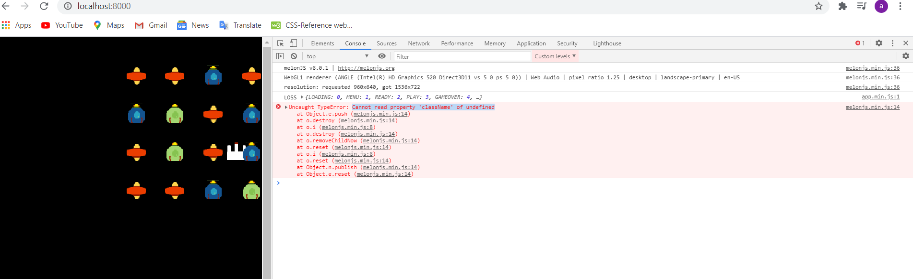

# melonJS boilerplate- SpaceInvaders
-------------------------------------------------------------------------------

## Description

Testing melonJS gaming platform and adding functionality to the existing Space Invaders game.

## Technologies

- melonJS
- Mobile optimized HTML/CSS
- NodeJs
- JavaScript
- WebGL
- WebAudio
- ES6 Collections

## To run distribution

To build, be sure you have [node](http://nodejs.org) installed. Clone the project:

    git clone https://github.com/melonjs/boilerplate.git

Then in the cloned directory, simply run:

    [sudo] npm install

Running the game:

	npm run serve

And you will have the boilerplate example running on http://localhost:8000

## Challanges

* Win & Loss Conditions: The condition for win and loss seemed pretty starightforward as explained in the tutorial but everytime ships get within the range of the player, application throws an error message "Cannot read property 'className' of undefined"

## Credits

Here is the link to the boilerplate code:

 

